1. **下载Anaconda**：前往[Anaconda官方网站](https://www.anaconda.com/)下载适用于你电脑版本的Anaconda安装程序(我这里是windows故下载windows版本的)、或者前往清华源镜像站下载对应电脑版本的anaconda(https://mirrors.tuna.tsinghua.edu.cn/anaconda/archive/)
   


2. **下一步**：运行安装程序，然后点击“Next”。
   

3. **同意条款**：点击“I Agree”。

   

4. **选择安装类型**：选择“All Users”，然后点击“Next”。
   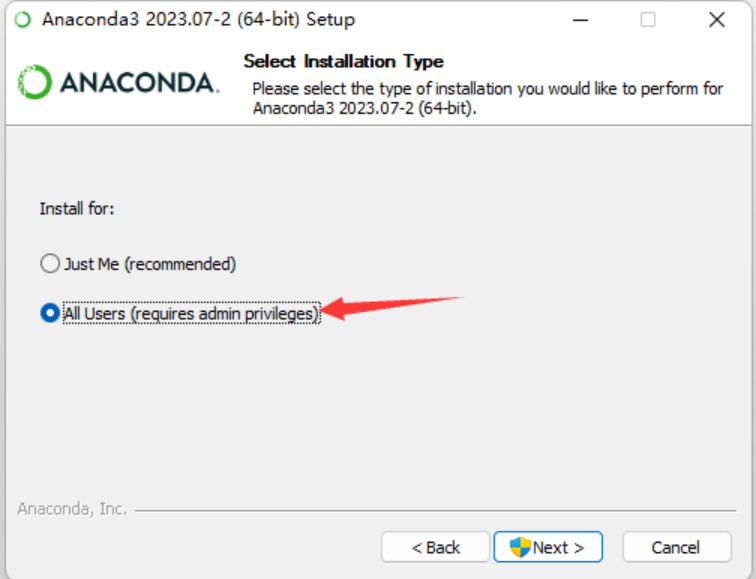

5. **选择安装位置**：在D盘或者其他位置创建一个名为“Anaconda”的文件夹。点击“Browse”选择该文件夹，然后点击“Next”。
   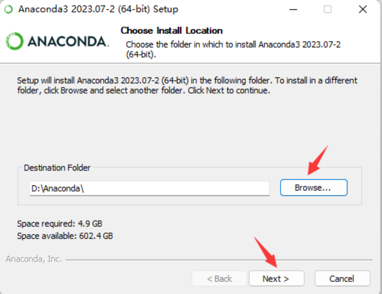

6. **安装选择**：选中所有三个选项，然后点击“Install”。
   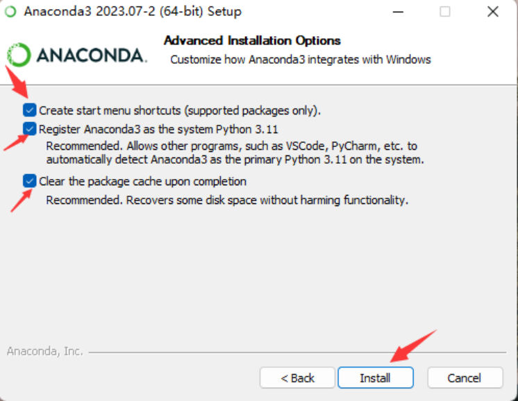

7. **安装进度**：等待安装进度条完成。如果你遇到两个Anaconda安装进程，请通过任务管理器关闭其中一个。
   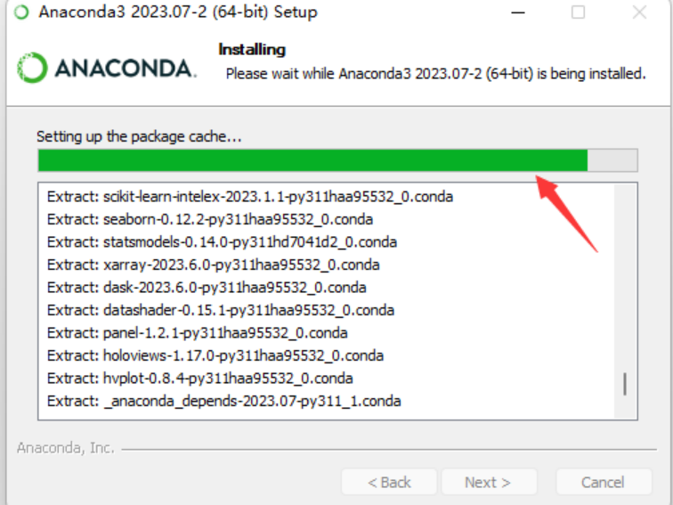

8. **安装完成**：安装成功后，点击“Next”。
   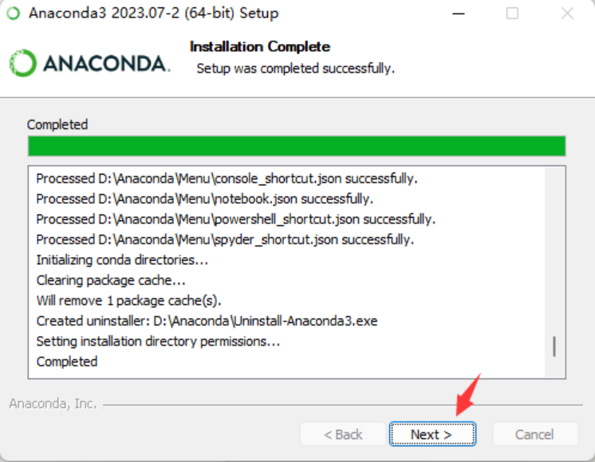

9. **附加软件**：点击“Next”。


   

10. **完成Anaconda安装**：不需要选择最后两个选项。点击“Finish”以完成安装。
    

11. **访问已安装的软件**：你可以在“开始”菜单下的“所有应用”中找到“Anaconda3”文件夹。
    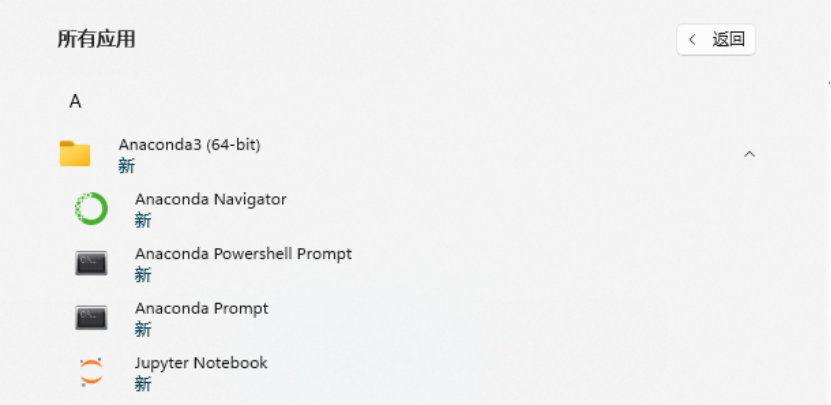

12. **配置环境变量**：
    - 搜索并打开“系统环境变量”，点击“编辑系统环境变量”（或者通过“此电脑”右键->属性->高级系统设置->环境变量 ->系统变量->找到“Path”->点击“编辑”->“新建”）
        
        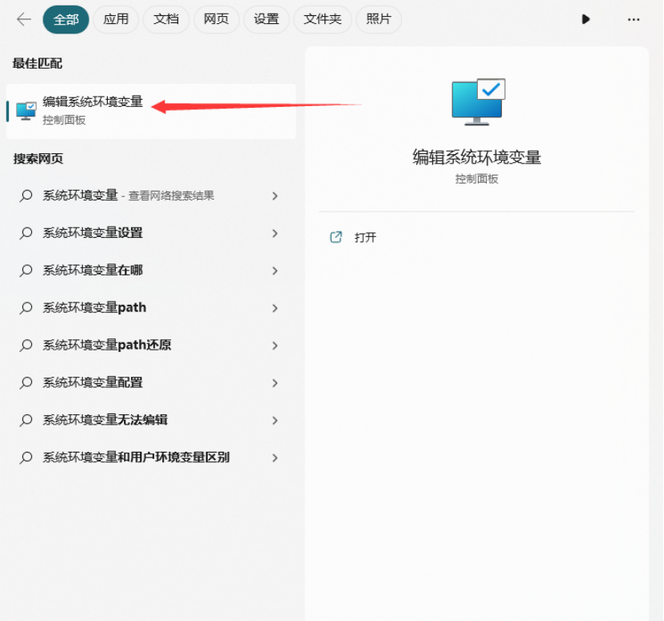
    - 点击“环境变量”。


        
    - 在“系统变量”下，选择“Path”，然后点击“编辑”。
        
    - 点击“新建”，将以下三个路径添加到系统环境变量中。确保根据你的Anaconda安装位置调整路径：
        - `D:\你的Anaconda安装路径`
        - `D:\你的Anaconda安装路径\Scripts`
        - `D:\你的Anaconda安装路径\Library\bin`
          
    - 添加完路径后，点击确定。
        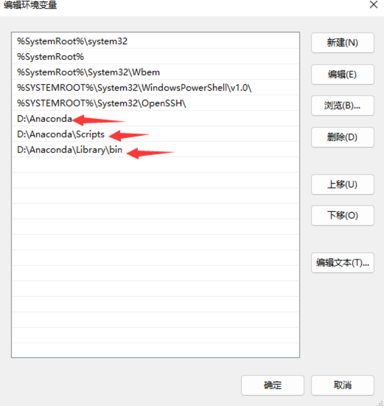
    
13. **测试安装**：
    - 打开Anaconda Prompt。
      
    - 输入`conda --version`检查Conda版本（验证是否安装了Conda）。
      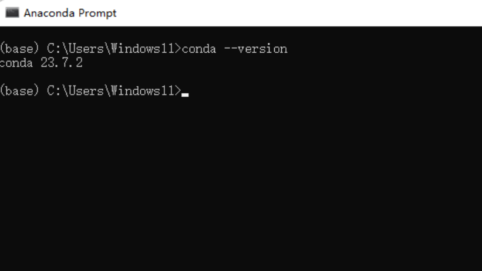
    - 输入`python`检查是否安装了Python（你将进入Python环境，输入`exit()`退出）。
      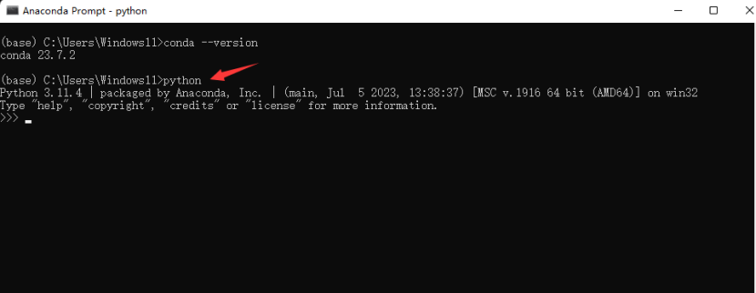

   注意：如果在输入`conda`时出现错误，表示Anaconda的环境变量配置不正确。


## 一、Anaconda常用指令

打开Anaconda Prompt终端，在终端中运行如下代码：

1. 查看conda版本

   ```
   conda --version 或 conda -V
   ```

2. 更新conda（将conda自身更新到最新版本）

   ```
   conda update conda
   ```

3. 创建虚拟环境

   ```
   conda create -n env_name python=3.9
   ```

   这表示创建一个名为env_name的环境并指定Python版本为3.9（-n中的n即是name）。

4. 激活虚拟环境

   ```
   conda activate env_name
   ```

   使用如上命令可激活创建的虚拟环境。

5. 退出虚拟环境

   ```
   conda deactivate
   ```

   使用如上命令可以退出当前正在使用的虚拟环境。

6. 删除虚拟环境

   ```
   conda remove -n env_name --all 或 conda remove --name env_name --all
   ```

   使用如上命令将名为env_name的虚拟环境以及其中的包都删除。

7. 列出所有虚拟环境

   ```
   conda env list 或 conda info --envs
   ```

8. 列出当前环境的所有包

   ```
   conda list
   ```

9. 安装第三方包

   ```
   conda install dill 或 pip install dill
   ```

   使用如上指令安装名为dill的软件包。

10. 卸载第三方包

    ```
    conda uninstall dill 或 pip uninstall dill
    ```

    使用如上指令卸载名为dill的软件包。

## 二、Anaconda更换默认下载源（可选）：

1. 打开Anaconda Prompt，然后输入如下命令添加清华源：

   ```
   conda config --add channels https://mirrors.tuna.tsinghua.edu.cn/anaconda/pkgs/free/
   conda config --add channels https://mirrors.tuna.tsinghua.edu.cn/anaconda/cloud/conda-forge 
   conda config --add channels https://mirrors.tuna.tsinghua.edu.cn/anaconda/cloud/msys2/
   conda config --add channels https://mirrors.tuna.tsinghua.edu.cn/anaconda/cloud/pytorch/
   ```

2. 设置搜索时显示通道地址

   ```
   conda config --set show_channel_urls yes
   ```

设置pip为清华源（打开Anaconda Prompt，输入如下代码）：

```
pip config set global.index-url https://pypi.tuna.tsinghua.edu.cn/simple
```

换源中常用的命令及含义：

1. 显示安装通道

   ```
   conda config --show channels
   ```

2. 添加源

   ```
   conda config --add channels url地址
   ```

3. 删除源

   ```
   conda config --remove channels url地址
   ```

   例如：conda config --remove channels https://mirrors.tuna.tsinghua.edu.cn/anaconda/pkgs/free/

4. 恢复默认源（换回默认设置）

   ```
   conda config --remove-key channels
   ```
   
## 三、创建环境以及配置 PyTorch

### 1. 创建 Python 3.9 环境

打开 Anaconda Prompt，创建一个名为 "test" 的 Python 3.9 环境，输入以下命令：

```shell
conda create -n test python=3.9
```


然后输入 "y"。

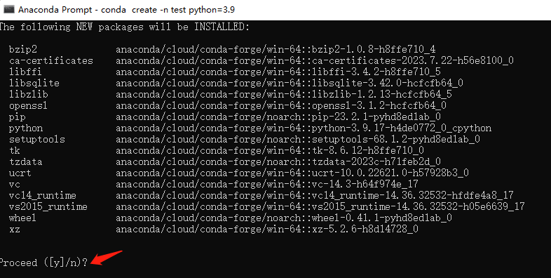

至此，已经完成了环境的创建。

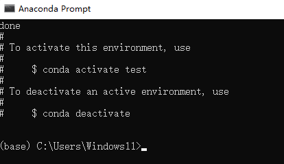

### 2. 在 "test" 环境中安装 PyTorch

首先，激活名为 "test" 的环境，输入以下命令：

```shell
conda activate test
```


然后，使用以下命令查看 CUDA 版本（非 NVIDIA 显卡用户请安装 CPU 版本的 PyTorch，无需执行此命令）：

```shell
nvidia-smi
```


若是 NVIDIA 显卡用户，且输入上述命令后仍报错，可以尝试将显卡驱动更新或找到 "nvidia-smi.exe" 并将其路径添加到系统环境变量的 "Path" 中。

接下来，进入 PyTorch 官方安装网址，选择以下安装选项：

- 第二行：根据自己的电脑版本选择
- 第三行：选择通过 pip 或 conda 安装（均可）
- 第五行：根据自己的 CUDA 版本来选择对应的 PyTorch 版本（非 NVIDIA 则选择 CPU 版本）
- 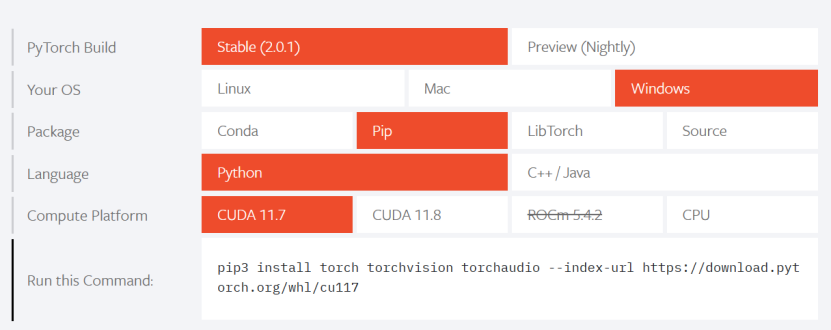

例如，如果 "nvidia-smi" 显示的 CUDA 版本为 12.0，则可以选择下载 CUDA 小于等于 12.0 的 PyTorch 版本。我这里选择的是 CUDA 11.7，复制以下命令：

```shell
pip3 install torch torchvision torchaudio --index-url https://download.pytorch.org/whl/cu117
```

或者点击 "previous versions of PyTorch" 选择之前的 PyTorch 版本。

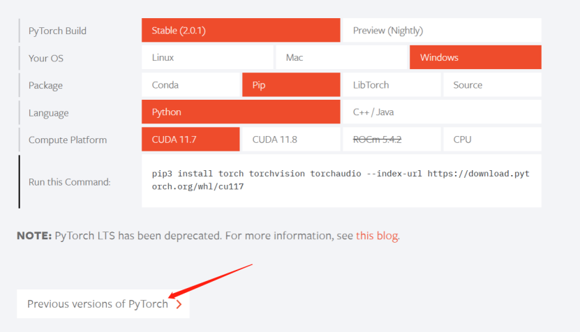

**注意：** 若下载失败，可以尝试更换网络，或多次重复执行命令，或者尝试 Anaconda 安装教程中的换源操作。

### 3. 安装完成之后测试

- 打开 Anaconda Prompt
- 激活刚刚创建的环境：`conda activate test`
- 输入 `python` 进入 Python 环境
- 输入 `import torch`，如果没有报错，则安装成功。

如果安装的是 GPU 版本的 PyTorch，您还可以通过输入以下命令检查是否安装成功：

```python
torch.cuda.is_available()
```

如果返回 `True`，代表成功。若需要退出 Python 环境，请输入 `exit()`。

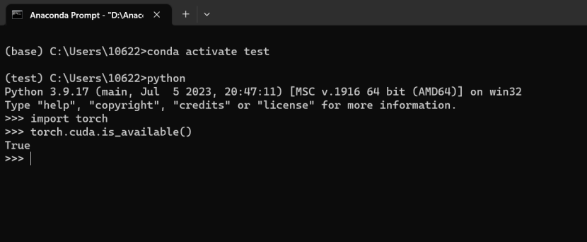
